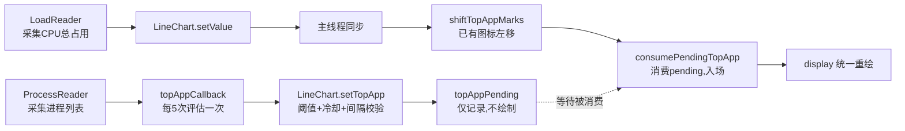
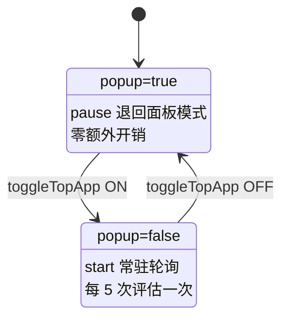

# Stats — CPU 曲线 Top App 图标标注改造 沉淀文档

> 目标读者：后续接手 Stats（exelban/stats）二次开发的同学
> 版本基线：v3.0.14 · 分支 `feature/cpu-linechart-topapp-v2` · Commit `6a471bb`
> 沉淀日期：2026-08-31

---

## 一、结论先行

本次改造在 **CPU 模块的 line chart 菜单栏 widget** 上实现了 ActivityLine 式能力：**免点击、不展开面板**，直接在菜单栏曲线上用 app 图标标注当前 CPU 占用最高的进程。

三个必须记住的核心结论：

1. **图标必须锚定曲线数据点**（而非独立计时动画），否则曲线滚动时图标会与曲线脱节。
2. **入场锚点必须置于图表右边界之外**，否则图标会「闪现」——这是全程最难排查、也最容易被误判为「已修复」的问题。
3. **宽度倍率必须与曲线点数同比放大**，否则每格位移随宽度线性放大，视觉上表现为「5x 下移动飞快」。

---

## 二、功能全景

### 2.1 最终交互行为

| 项 | 行为 |
|---|---|
| 入场 | 从曲线**最右端**缓慢滑入，全程约 22 秒（1x 宽度） |
| 移动 | 严格钉在曲线数据点上，随曲线以 ~0.51 pt/s 左移 |
| 出场 | 从左侧**渐进裁切**滑出，不瞬间消失 |
| 同一 app 冷却 | 两次滑入间隔 ≥ **30 秒** |
| 全局最小间隔 | 任意两图标滑入间隔 ≥ **10 秒** |
| 评估节流 | 每 5 次采集评估一次（实际 5 秒/次） |
| 阈值 | CPU 总占用低于阈值（默认 30%）不滑入新图标 |
| 宽度 | 1x / 2x / 3x / 5x 可配，各倍率移动速度一致 |

### 2.2 配置入口

Widget 右键 → Widget settings：

- `Show top app`（开关）
- `Top app threshold`（10/20/30/50/70/90%）
- `Chart width`（1x/2x/3x/5x）

Store key 前缀为 `CPU_line_chart_`（注意是 `line_chart`，带下划线，取自 `widget_t.lineChart.rawValue`）。

---

## 三、架构与数据流

### 3.1 数据流图



### 3.2 开关与采集联动

`ProcessReader` 原本 `popup = true`，只在下拉面板打开时才采集。改造后由开关联动：



---

## 四、代码地图（精确到行）

### 4.1 Kit/Widgets/LineChart.swift（核心，629 行）

**状态字段**

| 行号 | 字段 | 作用 |
|---|---|---|
| 24 | `topAppState` | 功能总开关 |
| 26 | `topAppIconSize = 12` | 图标边长 |
| 28 | `topAppThreshold = 0.3` | CPU 总占用阈值 |
| 30–37 | `topAppThresholdNumbers` | 阈值下拉选项 |
| 39 | `log` | 自造（见 5.1 坑位） |
| 43 | `topAppMarks` | 已入场标注：`(process, index, value)` |
| 45 | `topAppLastDrawTime` | 按 pid 的冷却时间戳 |
| 47 | `topAppCooldownSeconds = 30` | 同 app 冷却 |
| 49 | `topAppLastSpawnTime` | 全局上次滑入时刻 |
| 51 | `topAppMinSpawnInterval = 10` | 任意两图标最小间隔 |
| 70 | `widthScale` | 宽度倍率 |
| 77–94 | `width` | `基准宽 × widthScale` |
| 97–99 | `effectiveHistoryCount` | `historyCount × widthScale` |
| 356 | `topAppPending` | 待消费进程 |
| 398 | `rescaleBaseline` | 索引换算基准 |

**方法**

| 行号 | 方法 | 职责 |
|---|---|---|
| 308 | `drawTopAppMarks()` | 遍历 marks 绘制图标 + 裁剪 |
| 331 | `resetTopAppMarks()` | 清空标注与全部计时状态 |
| 340 | `shiftTopAppMarks()` | 每帧索引 -1，允许负索引 |
| 358 | `setTopApp()` | 三重校验后写入 pending |
| 386 | `rescaleTopAppMarks()` | 倍率切换时按比例换算索引 |
| 401 | `consumePendingTopApp()` | 主线程消费 pending |
| 429 | `setValue()` | shift → consume → display |
| 575/584/592/613 | 各 toggle action | 配置写入 + 重绘 |

### 4.2 Kit/plugins/Charts.swift（坐标辅助）

| 行号 | 方法 | 说明 |
|---|---|---|
| 627 | `pointCount()` | 曲线点数 |
| 632 | `spawnIndex(iconOffset:)` | **入场锚点核心**，返回 `count-1+extra` |
| 660 | `xStep()` | 相邻两点水平间距 |
| 668 | `pointAt(index:value:)` | 按索引+数值算坐标，允许负索引 |

### 4.3 其他文件

- `Modules/CPU/main.swift:81` `topAppState`（key 拼接必须与 widget 侧一致）
- `Modules/CPU/main.swift:211` `syncTopAppReaderState()` 采集联动
- `Modules/CPU/main.swift:242` `topAppCallback()` 评估节流
- `Kit/helpers.swift:794` `ancestorAppIcon()` 进程树回溯取图标
- `Kit/helpers.swift:812` `TopProcess.icon` 三级回落
- `Kit/types.swift:316` `.toggleTopApp` 通知名

---

## 五、踩坑记录（按代价排序）

### 5.1 Store key 不匹配 — 功能完全静默失效

widget 侧拼出 `CPU_line_chart_topApp`（`line_chart` 带下划线），module 侧原硬编码 `CPU_lineChart_topApp`（无下划线）→ 模块永远读到 `false`，采集器不启动、图标不显示，且**无任何报错**。

**教训**：key 一律用 `widget_t.xxx.rawValue` 拼接，禁止手写字符串。

### 5.2 Reader.setInterval 时序 — 间隔设置悄悄失效

`reader.swift:192` 的 `reset(seconds:, restart: self.active)` **仅在已 active 时才重建定时器**。原代码先 `setInterval` 后 `start()`，间隔完全不生效。

**正确顺序**：`start()` → `setInterval()`。

### 5.3 闪现（最难） — 曾被两次误判为「已修复」

**现象**：图标突然出现在图表中间，而非从右侧滑入。

**表面原因（第一轮，已修复）**：`setTopApp` 用 `main.async` 异步添加 mark，而 `setValue` 也用 `main.async` 做 shift。两条链排到主队列后，中间穿插多次 `setValue`（LoadReader 1s 比 ProcessReader 2s 快），mark 还没 display 就被 shift 到 index=55 甚至更低。

**解法**：Pending Queue 生产-消费模式——`setTopApp` 只写 `topAppPending`，由 `setValue` 在主线程同步消费，保证 shift 和 add 在同一循环内原子执行。

**深层原因（第二轮，真正根因）**：即使时序正确，图标锚定 `index = count-1` 且**中心对齐**锚点 → 入场瞬间图标中心恰在右边界，右半裁掉、**左半 50% 立即可见**（约 150px 直接跳出）。

**解法**：`spawnIndex(iconOffset:)` 让入场锚点落在图表右边界**之外**（本机 1x 下 index 从 59 → 72），可见像素从 0 开始渐进增长。

**警示**：当时用「新图标紧贴右边缘 x1=2103」作为通过依据，实为「半可见闪现」的证据。**验证必须测增长曲线，不能只看单帧位置。**

### 5.4 5x 下移动飞快 — 宽度与点数脱钩

`xStep = chartWidth / (点数-1)`。宽度 ×5、点数固定 60 → 每格位移 ×5.27。

**解法**：`effectiveHistoryCount = historyCount × widthScale`，点数同比放大。

| 倍率 | 点数 | xStep |
|---|---|---|
| 1x | 60 | 0.508 pt/s |
| 2x | 120 | 0.521 pt/s |
| 3x | 180 | 0.525 pt/s |
| 5x | 300 | 0.528 pt/s |

偏差 ≤4%（残余来自边框 offset 为固定值）。**副作用**：宽度 ×N = 显示 N 倍时长历史，这是速度一致的前提。

### 5.5 子类重复 deinit — 编译错误

基类 `module.swift` 已有 `deinit { removeObserver(self) }`，Swift 不允许子类再声明。

### 5.6 后台线程访问 NSView 几何

`setTopApp`/`shiftTopAppMarks` 原在后台队列调 `peakIndex()`/`xStep()`（内部读 `self.frame`）。必须把几何计算移到主线程，队列内只做状态判断。

### 5.7 其他

- **`Store` 无 `double` 方法**（只有 bool/string/int/array/data）→ 阈值用 string 存取后转换
- **`log` 在 `SWidget` 而非 `WidgetWrapper`**（`widget.swift:254`）→ `LineChart` 需自造 log
- **`cp -R` 到已存在目录会嵌套**并报 `Operation not permitted` → 部署前先 `rm -rf`
- **NextLog 走 stdout** → GUI 启动抓不到，须直接跑二进制；且重定向到文件会块缓冲，须用 `script -q` 伪终端

### 5.8 bundle id 封禁 — statusItem "隐形"的终极坑（代价最高）

**现象**：widget 代码全部正常执行（statusItem 创建成功、button 存在、日志无错），但菜单栏图标消失。重启电脑、清 NSStatusItem 记录、lsregister 重注册、改签名、Thaw 重置全部无效。

**根因**：系统对**旧 bundle id**（`eu.exelban.Stats`）的 statusItem 进入持久失败状态——覆盖部署 + 反复强杀导致 WindowServer/LS 缓存紊乱。

**破局**：改 `CFBundleIdentifier` 为新 id（`io.github.lj3lj3.Stats`）+ `defaults export/import` 迁移配置 + 重签名 + lsregister。

**教训**：
1. 二次开发的 fork 建议第一时间改 bundle id，避免与原版缓存冲突
2. `CGWindowList` 对 ad-hoc 签名 app 的 statusItem 检测**不可靠**（可见时也可能查不到 layer=25 窗口），勿以其为唯一判据；像素 + kill-diff 才是黄金标准
3. 排查"图标消失"时，**先查第三方菜单栏管理工具**（Thaw/Ice/Bartender 等），再查系统层——工具按 bundleId:autosaveName 记录归属，其配置在 `defaults read com.stonerl.Thaw "MenuBarItemManager.savedSectionOrder"`
4. stdout 日志在伪终端下仍有截断假象，勿以日志缺失判定进程 hang（sample 抓栈才是真相）

### 5.9 互联网同类问题考证 — 这是 macOS Tahoe 系统级缺陷

改 bundle id 解封后，对上游 issue 区做了考证，确认这不是孤例而是 **macOS 26 Tahoe 的系统性缺陷**：

| Issue | 环境 | 现象 | 与本案吻合度 |
|---|---|---|---|
| [#2704](https://github.com/exelban/stats/issues/2704) | 26.0 + 2.11.52 | 升级 Tahoe 后全部模块消失，权限正常 | 现象一致 |
| [#2823](https://github.com/exelban/stats/issues/2823) | 26.1 + 2.11.61 | 同上，Bartender 排除、重置无效 | 连"排除 Bartender"都一致 |
| [#3120](https://github.com/exelban/stats/issues/3120) | 26.4 + 2.12.8 | **"not hidden, just absent"**（进程正常注册 UIElement 但条目未创建） | **完全一致**（我们 CGWindowList 零窗口同因） |
| [#3581](https://github.com/exelban/stats/issues/3581) | 26.6.2 + 3.0.13 | 完全不显示；日志 `LSExceptions shared instance invalidated for timeout` | **环境几乎相同**；LS 超时 = LS 层紊乱实锤 |
| [#3416](https://github.com/exelban/stats/issues/3416) | — | app 更新后 widget 消失需逐个重加，标记 Done | 佐证"覆盖安装触发" |

**结论**：
1. 触发条件 = **覆盖安装/更新**（LS 记录失效），跨 26.0~26.6 全线存在，上游至今无显式修复（无相关 fix commit）
2. `LSExceptions timeout` 日志 + "process registers as UIElement but items absent" + "换 bundle id 立即恢复" 三条证据共同指向 **LaunchServices 对 statusItem 的持久注册缓存紊乱**
3. 我们独立发现的 **bundle id workaround**（改 CFBundleIdentifier + 迁移 defaults + 重签 + lsregister）是社区 issue 区尚未总结出的解法
4. Thaw 的 `com.stonerl.Thaw.MenuBarItemService` 后台服务只探测系统 app（42 条 misses，无 Stats），并非封禁者

**遗留验证项**：Tahoe 新增的「系统设置 → 菜单栏」per-app 显示控制（#3120 提及）可能是封禁状态的 GUI 入口，值得在旧 bundle id 环境下复查该设置面板。

---

## 六、验证方法（可复用）

### 6.1 为何需要像素验证

菜单栏 widget 无法单元测试，且模型看不到截图。采用**程序化像素分析**替代肉眼。

### 6.2 三板斧

| 方法 | 用途 | 关键实现 |
|---|---|---|
| **帧差法定位** | 找到图表在屏幕上的坐标 | 间隔 3s 两帧 diff，曲线必移动 → 变化簇即图表 |
| **条带监控** | 验证渐进入场 | 只盯最右 6pt，旧图标已移出，像素增长即入场过程 |
| **spawnIndex 反推** | 验证宽度/点数 | 它直接读 `frame.width`，返回值可反解渲染参数 |

### 6.3 环境准备

```bash
python3 -m venv /tmp/stats_verify_venv
/tmp/stats_verify_venv/bin/pip install pillow -i "https://mirrors.cloud.tencent.com/pypi/simple"
```

> macOS 自带 Python 受 PEP 668 保护，必须 venv；pip 一律加腾讯云镜像源。

### 6.4 采集日志（NextLog 走 stdout）

```bash
pkill -x Stats
nohup script -q /tmp/stats.log <Debug.app>/Contents/MacOS/Stats > /dev/null 2>&1 &
grep "top app mark" /tmp/stats.log
```

> 必须用 `script -q` 包一层，否则块缓冲导致日志不落盘。

### 6.5 验收标准（缺一不可）

- [ ] 新 mark 入场瞬间右缘条带像素 = 0（不是直接跳到一半）
- [ ] 入场像素持续增长、无跳变（~20px/s）
- [ ] 出场图标像素渐进递减至 0
- [ ] 同 pid 两次 mark 间隔 ≥30s
- [ ] 相邻 mark 间隔 ≥10s
- [ ] 各倍率 spawnIndex 符合理论值

---

## 七、Git 与 Fork 协作

### 7.1 远程配置

| 远程 | 地址 | 用途 |
|---|---|---|
| `origin` | `git@github.com:<你的账号>/stats.git` | 自己的 fork，推送目标 |
| `upstream` | `git@github.com:exelban/stats.git` | 上游仓库，同步来源 |

### 7.2 认证（HTTPS 已废弃）

GitHub 不再支持密码认证，报 `Invalid username or token` 时改用 SSH：

```bash
ssh-keygen -R github.com
ssh-keyscan -t rsa,ed25519 github.com >> ~/.ssh/known_hosts
ssh -T git@github.com          # 验证：Hi <账号>!
git remote set-url origin git@github.com:<账号>/stats.git
```

### 7.3 上游同步

```bash
git checkout -b backup/xxx-pre-rebase     # 先备份
git fetch upstream
git log --oneline HEAD..upstream/master   # 查看新增
git rebase upstream/master
xcodebuild ... build                      # 必须重新验证编译
git push
```

### 7.4 Rebase 后推送被拒（禁用 force push）

rebase 改写历史后普通推送报 `tip of your current branch is behind`。**按规范禁止 force push**，改推新分支：

```bash
git checkout -b <分支名>-v2
git push -u origin <分支名>-v2
```

随后到 GitHub 删掉旧分支避免混淆。

---

## 八、构建与部署

### 8.1 构建（必须禁用签名）

项目硬编码原作者 Developer ID（team `RP2S87B72W`），本地无私钥：

```bash
cd /Users/darylliu/Code/mine/swift/stats
DEVELOPER_DIR=/Applications/Xcode.app/Contents/Developer xcodebuild \
  -project Stats.xcodeproj -scheme Stats -configuration Release \
  -destination 'platform=macOS' \
  CODE_SIGNING_ALLOWED=NO CODE_SIGN_IDENTITY="" CODE_SIGNING_REQUIRED=NO build
```

> `xcode-select -s` 需 sudo，用 `DEVELOPER_DIR` 环境变量绕过。

### 8.2 部署（含签名修复，必须完整执行）

```bash
pkill -x Stats
rm -rf /Applications/Stats.app     # 必须先删，否则 cp -R 会嵌套
cp -R <Release/Stats.app> /Applications/Stats.app
# 关键：ad-hoc 签名。无签名 app 经 LaunchServices 启动时 NSStatusItem
# 可能创建成功但不被 WindowServer 渲染（图标消失）
codesign -s - --force --deep /Applications/Stats.app
/System/Library/Frameworks/CoreServices.framework/Frameworks/LaunchServices.framework/Support/lsregister -f /Applications/Stats.app
open /Applications/Stats.app
```

### 8.3 部署后"图标消失"排查清单（按顺序）

1. **第三方菜单栏管理工具**（Thaw/Ice/Bartender/Hidden Bar/Dozer）——最高频原因！
   工具会按 bundleId:autosaveName 记录图标归属，覆盖部署后可能不再显示
2. **杀进程像素对比法**确认归属：`screencapture` 杀前后各一张，diff 消失簇即 Stats 区域
   （注意：图标重排会导致簇位置漂移，需对比"总宽/总像素"而非逐簇坐标）
3. **多显示器**：widget 只在主显示器菜单栏
4. **刘海遮挡**：图标过多被挤进刘海后
5. **双进程残留**：反复 pkill/open 可能产生多实例，`pgrep -x Stats | wc -l` 检查
6. **NSStatusItem 位置记录**：`defaults read eu.exelban.Stats | grep NSStatusItem`，
   超出屏宽（如 5940 > 1728）的值可删除
7. **bundle id 封禁**：极端情况下系统对旧 bundle id 的 statusItem 持久不渲染，
   改 Info.plist 的 CFBundleIdentifier（如 `io.github.lj3lj3.Stats`）+ 迁移
   `defaults export/import` + 重签名可解（本次最终采用）

### 8.4 调试配置

```bash
defaults read eu.exelban.Stats CPU_line_chart_topApp
defaults write eu.exelban.Stats CPU_line_chart_widthScale -int 5
```

> 注意：改 bundle id 后配置域随之变化，需 `defaults export` 旧域 → `defaults import` 新域。

### 8.5 验证工具（像素级）

macOS 自带 Python 受 PEP 668 保护，先建 venv：

```bash
python3 -m venv /tmp/stats_verify_venv
/tmp/stats_verify_venv/bin/pip install pillow -i "https://mirrors.cloud.tencent.com/pypi/simple"
```

帧差法定位图表区域 + kill-diff 归属判定 + spawnIndex 反推渲染参数，三板斧详见第六章。

---

## 九、遗留问题与后续建议

### 9.1 已知隐患

| 问题 | 位置 | 说明 |
|---|---|---|
| `log` 属性遮蔽风险 | `LineChart.swift:39` | 若将来给 `WidgetWrapper` 加同名 `log`，会被子类遮蔽 |
| `rescaleBaseline` 读写不一致 | `LineChart.swift:391/394` | 在 `queue.sync` 闭包内读、闭包外写，非原子 |
| `consumePendingTopApp` 未参与重算 | `LineChart.swift:401` | 倍率切换瞬间新入场图标的索引基准可能不同步 |

### 9.2 优化建议

1. **收窄 log 粒度**：验证期日志每 20s 一条，长期运行建议降级为 debug 或移除
2. **阈值只控制新滑入**：已入场图标不追溯清理，会走完整个周期（1x 约 60s、3x 约 180s），如需即时生效可在 `drawTopAppMarks` 加实时过滤（但要防抖动闪烁）
3. **窄图表图标重叠**：1x（32pt）下 12pt 图标超过 2 个会视觉重叠，建议默认 2x 或收窄图标
4. **采集间隔被 UI 覆盖**：用户在设置里改 CPU 更新间隔会覆盖 topApp 的独立间隔（当前实测 1s），如需严格隔离应拆分独立 Reader

### 9.3 未完成的验证

3x / 5x 的像素级测量因**屏幕锁定**（`screencapture` 返回全黑/壁纸）中断，仅有 `spawnIndex` 反推的代码级证据。可在解锁后补测。

---

## 十、复盘：三条方法论

1. **看不到就用数据代替眼睛** — 菜单栏/UI 动画无法单测，像素分析 + 日志时序关联是可复制的验证范式。
2. **「看起来对」不等于「真的对」** — 闪现问题两次被误判通过。单帧位置正确 ≠ 过程正确，**必须验证变化曲线**。
3. **改动前先问「同比还是绝对」** — 宽度放大 5 倍时，点数、图标尺寸、位移速度哪些该同比、哪些该固定，先想清楚再动手，能省掉一整轮返工。
